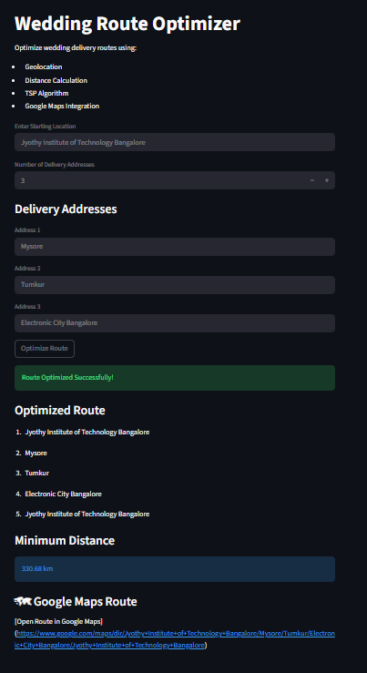
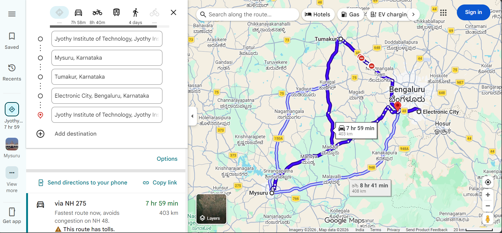

#  Wedding Route Optimizer

Live Link:
https://ada-project.streamlit.app/

A full-stack route optimization system built using **Python, FastAPI, Streamlit, and Traveling Salesman Problem (TSP)**.

This project helps optimize wedding delivery/navigation routes by finding the shortest possible path between multiple locations and generating a Google Maps route.


---

# Features

*  Address to Coordinates Conversion
*  Distance Calculation using Haversine Formula
*  Traveling Salesman Problem (TSP)
*  Google Maps Route Generation
*  FastAPI Backend
*  Streamlit Frontend
*  Real-world Route Optimization

---

#  Technologies Used

## Frontend

Streamlit

## Backend

* FastAPI
* Python

## Algorithms
* Dfs
* Backtracking 

## APIs

* OpenStreetMap Nominatim API
* Google Maps

---

# 📂 Project Structure

```text
Wedding-Route-Optimizer/
│
├── backend/
│   ├── main.py
│   ├── ad_to_coord.py
│   ├── distance.py
│   ├── tsp.py
│   ├── maps_redirect.py
│   └── requirements.txt
│
├── frontend/
│   ├── app.py
│   └── requirements.txt
│
└── README.md
```

---

#️ Installation

## Step 1 — Clone Repository

```bash
git clone https://github.com/your-username/wedding-route-optimizer.git
```

---

## Step 2 — Create Virtual Environment

```bash
python -m venv venv
```

---

## Step 3 — Activate Virtual Environment

### Windows

```bash
venv\Scripts\activate
```

### Linux/Mac

```bash
source venv/bin/activate
```

---

#  Backend Setup

## Go to Backend Folder

```bash
cd backend
```

## Install Dependencies

```bash
pip install -r requirements.txt
```

## Run Backend Server

```bash
python -m uvicorn main:app --reload
```

Backend runs at:

```text
http://127.0.0.1:8000
```

---

#  Frontend Setup

## Open New Terminal

Activate virtual environment again.

## Go to Frontend Folder

```bash
cd frontend
```

## Install Dependencies

```bash
pip install -r requirements.txt
```

## Run Streamlit App

```bash
streamlit run app.py
```

Frontend runs at:

```text
http://localhost:8501
```

---

#  How It Works

```text
User Inputs Addresses
        ↓
Geocoder converts addresses → coordinates
        ↓
Distance matrix is generated
        ↓
TSP algorithm finds shortest route
        ↓
Google Maps route URL generated
        ↓
Optimized route displayed
```

---

#  Haversine Formula

Used to calculate distance between two geographical locations.

---

#  TSP Algorithm

The Traveling Salesman Problem is solved using:

* DFS (Depth First Search)
* Backtracking

Goal:

* Visit all locations exactly once
* Find shortest possible route
* Return to starting location

---

#  Example Input





This project is developed as part of ADA(BCS401) assignment under 

Dr. Swathi K

M.Tech, Ph.D

Associate Professor 

Dept of Computer Science And Engineering

Jyothy Institute of Technology, Bangalore

#  Authors

R Neha Sree(1JT24CS116)

Pooja K(1JT24CS105)

Pooja U(1JT24CS106)


